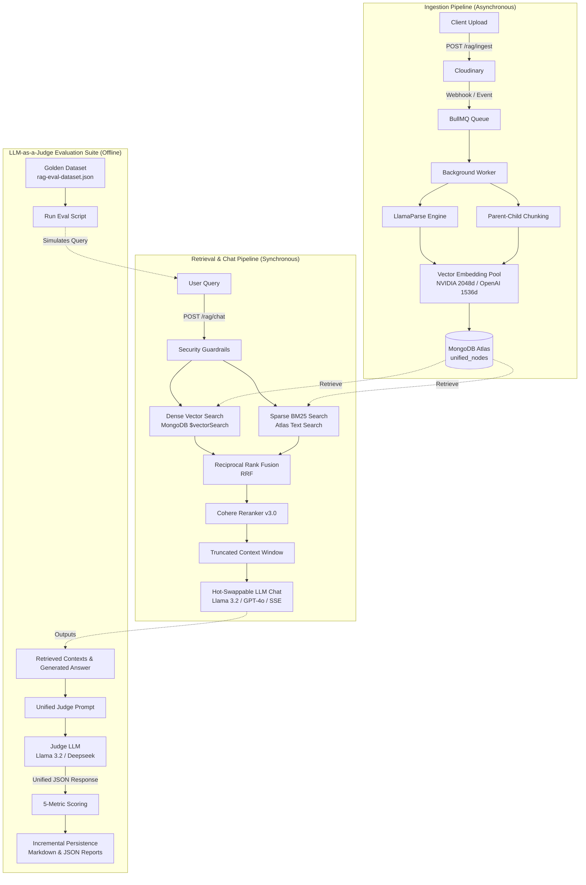

# BugBaar Engine: Hybrid RAG Service

## Title & Overview
The BugBaar RAG module is a production-grade, provider-agnostic Retrieval-Augmented Generation engine. It powers the conversational and search capabilities of the BugBaar e-commerce platform by merging dense semantic understanding with lexical precision. By executing parallel vector and text searches and merging them via Reciprocal Rank Fusion (RRF), it delivers highly accurate context across both product catalogs and deep document knowledge bases. The engine is fully decoupled from specific LLM vendors, allowing seamless hot-swapping between models.

## Key Features
- **Factory Pattern Architecture:** Dynamically switch between OpenAI and NVIDIA NIM for embeddings, summarization, and chat simply by changing an environment variable.
- **Direct Cloudinary Ingestion Bypass:** Documents are uploaded securely to Cloudinary, allowing the ingestion worker to stream them directly without exhausting main server memory.
- **BullMQ Background Ingestion:** Heavy operations like multimodal PDF parsing (via LlamaParse), chunking, and embedding are offloaded to robust Redis-backed queues.
- **SSE Streaming Endpoints:** Real-time token streaming via Server-Sent Events (SSE) for fluid, responsive chat UIs.
- **Reciprocal Rank Fusion (RRF) & Cohere Reranking:** Merges `$vectorSearch` and `$search` results mathematically, then reranks top candidates with a cross-encoder for supreme relevance.

## Architecture & Abstraction
The system strictly adheres to Dependency Inversion (SOLID). The core orchestrators (`RAGPipelineService`, `HybridRetrievalService`) do not import concrete SDKs. Instead, they depend on clean, well-documented interface contracts:
- `ILLMProvider`: Defines standard `generate` and `generateStream` methods.
- `IEmbeddingProvider`: Defines `embed` and `embedBatch`.
- `IVectorStore`: Abstracts the database (MongoDB Atlas) behind generic `vectorSearch`, `textSearch`, and `hasDocuments` queries.

**Why this matters:** Dependency Inversion protects the engine from vendor lock-in. If a new state-of-the-art model is released, developers only need to create a new class implementing the interface (e.g., `AnthropicLLMProvider`) and update the Factory, leaving the core retrieval logic completely untouched.

## 📐 Architecture Flow



## Prerequisites
To run the RAG engine locally, you will need active accounts/credentials for:
- **MongoDB Atlas:** (M0 tier or higher) with Vector Search enabled.
- **Redis:** Local instance or cloud provider (for BullMQ).
- **Cloudinary:** For document asset hosting.
- **LlamaCloud:** For LlamaParse API access.
- **OpenAI or NVIDIA NIM:** For embeddings and generation.
- **Cohere:** For document reranking.

## Database Setup (Critical)
The engine relies on MongoDB Atlas for unified storage. You must create a Vector Search Index on the `unified_nodes` collection name as `vector_index`. 

**IMPORTANT:** The `numDimensions` must match your chosen embedding provider:
- **NVIDIA:** `2048` (`nvidia/nemotron-3-embed-1b`)
- **OpenAI:** `1536` (`text-embedding-3-small`)

```json
{
  "fields": [
    {
      "numDimensions": 2048,
      "path": "embedding",
      "similarity": "cosine",
      "type": "vector"
    },
    {
      "path": "type",
      "type": "filter"
    }
  ]
}
```
*(Also ensure you create a standard Atlas Search index named `product_text_index` on the product fields).*

## Getting Started

You can run the BugBaar RAG engine either through Docker (Recommended for production/portability) or natively for local development.

### Option 1: Docker Deployment (Recommended)
This approach automatically spins up the API, the Background Worker, and a local Redis instance without needing any host-level dependencies other than Docker.

1. **Configure Environment**
   Copy the example template and fill in your keys (API keys for OpenAI/NVIDIA, MongoDB, Cloudinary, etc.):
   ```bash
   cp .env.example .env
   ```

2. **Run with Docker Compose**
   From the `rag` directory, simply run:
   ```bash
   docker-compose up -d --build
   ```
   The engine will boot up on `http://localhost:3001/rag`. You do not need a local Redis server; the compose file provisions one for you automatically.

### Option 2: Local Development

1. **Install Dependencies**
   ```bash
   npm install
   ```

2. **Configure Environment**
   ```bash
   cp .env.example .env
   ```
   *Note: For local development, you must have a local Redis server running on port 6379, or update `REDIS_URL` in `.env` to point to a remote instance.*

3. **Start the Background Worker**
   Run the BullMQ ingestion worker in a separate terminal:
   ```bash
   npm run worker
   ```

4. **Start the Express Server**
   ```bash
   npm run dev
   ```
   The engine will boot up on `http://localhost:3001/rag`.

---

## 🔌 API Reference & Usage

### 1. Ingest a Document
Upload a PDF or text document to be processed asynchronously by the BullMQ worker.
* **Endpoint:** `POST /rag/ingest`
* **Content-Type:** `multipart/form-data`
* **Form Field:** `file` (Binary `.pdf`, `.txt`, `.md`)
* **Response (202 Accepted):**
```json
{
  "success": true,
  "jobId": "bullmq-job-84920",
  "status": "queued",
  "message": "Document uploaded and queued for processing"
}
```

### 2. Hybrid Search Retrieval
Retrieve fused and reranked context chunks without generating an LLM response.
* **Endpoint:** `POST /rag/retrieve`
* **Content-Type:** `application/json`
* **Body:**
```json
{
  "query": "What were the total revenues in fiscal 2025?",
  "limit": 5,
  "includeDocuments": true,
  "includeProducts": true
}
```

### 3. Synchronous Chat
Context-augmented chat with integrated citation and source metadata.
* **Endpoint:** `POST /rag/chat`
* **Content-Type:** `application/json`
* **Body:**
```json
{
  "message": "Who is the current President and CEO of NIKE?",
  "history": []
}
```

### 4. Streaming Chat (SSE)
Real-time token streaming over Server-Sent Events.
* **Endpoint:** `POST /rag/chat/stream`
* **Headers:** `Accept: text/event-stream`
```bash
curl -N -X POST http://localhost:3001/rag/chat/stream \
  -H "Content-Type: application/json" \
  -d '{"message": "Summarize the primary risk factors regarding foreign exchange."}'
```

---

## ⚖️ Capabilities vs. Known Limitations

To provide complete transparency for developers evaluating this engine for production use:

### ✅ What This Engine Excels At
* **Narrative & Entity Retrieval:** Near-100% precision on extracting corporate officers, strategic goals, addresses, and narrative statements from dense documents.
* **Adversarial & Refusal Guardrails:** Effectively resists hallucinations and sycophancy. If an entity does not exist in the corpus (e.g., asking for Adidas figures in a Nike 10-K) or if a prompt contains a false premise, the engine explicitly rejects the premise or refuses to answer.
* **Non-Blocking High-Volume Ingestion:** Large documents (100+ pages) are streamed to Cloudinary and offloaded to BullMQ, preventing Node.js event-loop starvation and HTTP gateway timeouts.
* **Zero Vendor Lock-In:** Embedding dimensions and chat endpoints decouple cleanly via interfaces, allowing you to hot-swap models during provider outages in seconds.

### ⚠️ Current Limitations & Trade-offs
* **Dense Multi-Page Financial Tables:** While standard parent-child chunking captures narrative text cleanly, complex financial matrices (e.g., Consolidated Balance Sheets spanning multiple columns and pages) can become fragmented across chunk boundaries. For purely numerical table lookups, a specialized table-to-markdown or Text-to-SQL pipeline is recommended.
* **Infrastructure Footprint:** This is not a lightweight local script. To run the full stack, you must provision access to MongoDB Atlas (with search indexes configured), Redis, Cloudinary, LlamaParse, Cohere, and an LLM provider.
* **Strict Filter Schemas in Atlas:** Vector search queries utilizing metadata filters (e.g., `filter: { type: "document" }`) require those exact fields to be pre-indexed in your Atlas Vector Search JSON definition; otherwise, queries will return zero candidates silently.

---

## 📊 Evaluation & Benchmark Results

Evaluated against SEC Form 10-K filings using our unified, single-pass LLM-as-a-judge suite.
*Note: All evaluation outputs (Markdown & JSON) are generated and saved automatically in the `tests/eval/reports/` directory whenever you run `npm run eval`.*

| Query Archetype | Context Precision | Context Recall | Faithfulness | Answer Relevancy | Behavior |
| :--- | :---: | :---: | :---: | :---: | :--- |
| **Direct Factual Lookups** | **100%** | **90%** | **100%** | **100%** | Exact entity & metric extraction |
| **Negative Out-of-Domain** | N/A* | 0% | **100%** | **100%** | Clean refusal; zero hallucination |
| **Adversarial False Premise** | N/A* | **100%** | **100%** | **100%** | Rejects false assumptions in prompt |

*\*Precision drops on unanswerable/negative queries by mathematical definition, as no valid ground-truth chunks exist in the corpus.*

---

## 📂 Repository Structure

```markdown
rag/
├── src/
│   ├── config/              # Environment parsing and service configurations
│   ├── controllers/         # Express route controllers
│   ├── infrastructure/      # Database & queue clients (MongoDB, Redis)
│   ├── interfaces/          # SOLID interface definitions (ILLMProvider, etc.)
│   ├── lib/                 # Structured logging and global utilities
│   ├── middlewares/         # Multer file validation and global error handlers
│   ├── providers/           # Concrete implementations (Nvidia, OpenAI, Cohere, Mongo)
│   ├── routes/              # Express API endpoint declarations
│   ├── services/            # Core business logic (RAGPipeline, HybridRetrieval, Guardrails)
│   ├── utils/               # Robust JSON regex extraction & token counters
│   ├── workers/             # BullMQ background ingestion workers
│   ├── app.ts               # Express application initialization
│   └── server.ts            # Application bootstrap & port listener
├── tests/
│   └── eval/                # LLM-as-a-Judge test suites & Golden Datasets
├── docker-compose.yml       # Production-ready Redis & App orchestration
└── tsconfig.json            # Strict TypeScript configuration
```

---

## Developer Experience (DX) & Resilience
To ensure true production-level reliability, the system implements robust, multi-layered resilience strategies:
- **Graceful Fallbacks:** The ingestion pipeline relies heavily on the `createFallback` method within summarization providers. If an LLM returns an empty summary or fails to process a complex table chunk, the system gracefully falls back to structured raw text mapping rather than failing the job.
- **API Rate Limiting (429/503) Handling:** The NVIDIA client uses an advanced custom `retry-handler` that inspects HTTP headers. It automatically catches `429 Rate Limit` and `503 Service Unavailable` errors, parsing the `Retry-After` header to securely throttle requests with exponential backoff, preventing catastrophic failures during peak loads.

## 🤝 Contributing
- **Note:** This repository is currently released as a reference architecture. While I am not accepting Pull Requests at this time, please feel free to fork the repository, explore the code, and adapt it for your own use cases!